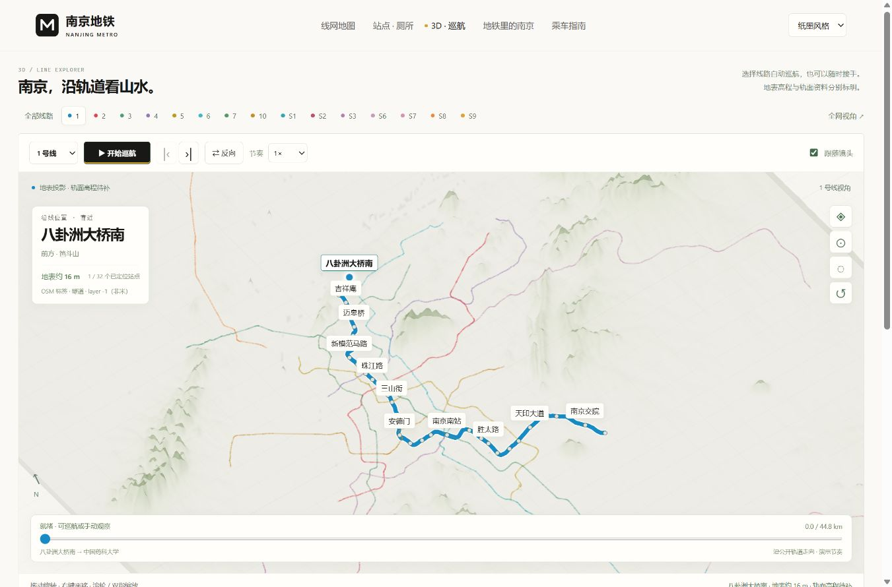

# 南京地铁 · Nanjing Metro

<div align="center">
  <b>中文</b> · <a href="README.en.md">English</a>
</div>

> **查线网、找厕所，沿线路看南京。**
> 可本地运行的独立网站，提供站点资料和交互式三维巡航。

## 在线访问

**https://nanjing.atompower.cn/metro/**

各页直达：[线网地图](https://nanjing.atompower.cn/metro/) · [站点 · 厕所](https://nanjing.atompower.cn/metro/#station-info) · [出站即达](https://nanjing.atompower.cn/metro/exits.html) · [换乘实验室](https://nanjing.atompower.cn/metro/transfer.html) · [线路人格](https://nanjing.atompower.cn/metro/quiz.html) · [线网之最](https://nanjing.atompower.cn/metro/records.html) · [3D · 巡航](https://nanjing.atompower.cn/metro/terrain.html)

站点是纯静态页面，也可按第 5 节自行部署。

[](LICENSE)
[](https://github.com/AFAP/nanjing-metro/releases)
[](https://github.com/AFAP/nanjing-metro/actions/workflows/release.yml)

## 1. 它解决了什么问题

将线路导览、站点资料、厕所位置和地表海拔放在同一个入口。

```text
公开来源 → data/ → 本地服务 / 静态网页 → 查询与巡航
```

## 2. 功能特性

- ✅ 彩色线路图，支持高亮、缩放和车站查询。
- ✅ 15 条线路、263 座车站的结构化资料，厕所位置保留来源。
- ✅ 出站即达：官网出站信息整理成可搜索清单，标注出口号与步行距离（2766 条地点、180 座车站）。
- ✅ 换乘实验室：站点联想输入，给出换乘最少与坐得最少的两种走法，出站换乘单独提醒。
- ✅ 线路人格：六道题从 15 条线路里找出最像你的一条，并列出沿线可去的地方。
- ✅ 线网之最：交汇最多的车站、换乘站最多的线路、最长与最短的站名，全部按官方站序统计。
- ✅ 三维巡航支持暂停续播、反向、调速、进度拖动和逐站跳转。
- ✅ 自由旋转、平移、缩放，地表海拔曲线与车站联动。
- ✅ 各页共用固定导航，城市浅绿、纸墨风格可切换并记住选择。



## 3. 目录结构

```text
src/          # 网页源码与本地 Three.js
data/         # 公开结构化资料与采集说明
scripts/      # 打包、采集和验证
docs/         # 版本记录
screenshot/   # 页面预览
server.mjs    # 本地服务
```

## 4. 快速开始

```bash
npm start
```

需要 Node.js 22 或更高版本，无需安装运行依赖。打开 `http://localhost:4173/`；三维页为 `http://localhost:4173/terrain.html`。Windows 也可双击 `启动网站.cmd`。

## 5. 使用与部署

| 操作 | 方式 |
| --- | --- |
| 查厕所 | 在“站点 · 厕所”搜索站名或按线路筛选 |
| 找出口 | 在“出站即达”搜地点名（如“总统府”），或按“车站”查看该站各出口通向哪儿 |
| 规划换乘 | 在“换乘实验室”输入起终点，自动给出换乘方案 |
| 自动巡航 | 在三维页选择线路，点击“开始巡航” |
| 手动观察 | 拖动旋转、右键平移、滚轮或双指缩放，自动巡航随即暂停 |
| 切换风格 | 使用顶部风格选择器，各页共用选择 |
| 本地补充 | 访问 `/?edit=1#station-info`，记录只保存到本地 |

生成静态文件：

```bash
npm run build
```

将生成的 `dist/` 部署到静态托管服务，或下载 Release 压缩包。静态网站不提供本地记录写入功能。升级前备份 `data/manual-reviews.json`，再替换源码并重新启动。

## 6. 安全与隐私

**本地服务只监听 `127.0.0.1`。个人补充记录、环境文件、部署配置和原始缓存均不提交，也不进入静态发布包。**

页面不展示人工核对徽标，数据仍保留 `human_verified` 字段。详见 [SECURITY.md](SECURITY.md)。

## 7. 开发与发布

```bash
npm test
npm run build
```

`src/` 是网页源码，`data/` 是唯一公开数据源，打包时生成副本。Three.js 0.180.0 已附带，许可见 `src/vendor/THREE-LICENSE.txt`。

Actions 支持手动构建。推送 `v*` 标签后，自动发布压缩包、SHA-256 校验和及变更说明。`dist/` 不入库。

Python 采集脚本是可选维护工具，需要原始缓存。缓存和中间解析文件不随仓库分发；依赖版本见 `scripts/requirements.txt`。

## 8. 相关文档

- [数据字段与收集范围](data/README.md)
- [厕所资料覆盖情况](data/collection-report.md)
- [三维来源与精度](data/3d-research.md)
- [版本记录](docs/CHANGELOG.md)
- [第三方资料与许可](NOTICE.md)

二维导览图保留 2026 年 4 月快照（14 条线路，未含 6 号线）；站点目录与三维路径采集于 2026 年 10 月 1 日，共 15 条线路、263 座车站，其中 37 座为换乘站。262 站已定位，红山新城坐标留空。高度为地表估值，完整地下轨面绝对标高尚缺，不将相对层级换算成米数。

## 9. License

MIT © 2026 contributors。第三方资料遵循各自权利和许可，见 [NOTICE.md](NOTICE.md)。

本项目是独立城市指南，非南京地铁官方网站。运营和设施以官方公告及站内标识为准；高程不用于工程测量。
